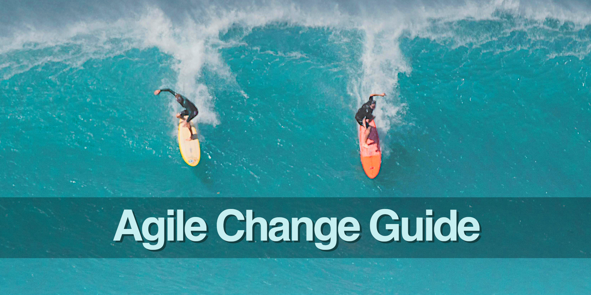

<!--
* browser: agile-change-guide
* tracker: cc7ca906a39d999812c39a08f107ddb3
* version: 1.0.0
* updated: 2023-07-26T10:54:04Z
* contact: Joel Parker Henderson (http://joelparkerhenderson.com)
* options: commentable
-->

# Agile Change Guide

Agile Change Guide: this book explains one topic per page, like a big glossary, easy wiki, quick encyclopedia, or summary notes.

* Get the book: 
  [Free EPUB](https://github.com/SixArm/agile-change-guide/raw/main/agile-change-guide.epub), 
  [Free PDF](https://github.com/SixArm/agile-change-guide/raw/main/agile-change-guide.pdf),
  [Gumroad](https://gumroad.com/l/agile-change-guide).
* Edited by [Joel Parker Henderson](https://github.com/joelparkerhenderson)
* For questions and suggestions [email me](mailto:joel@joelparkerhenderson.com)

## Contents

### [Introduction](topics/agile-change-guide-introduction)

* [What is agile?](topics/what-is-agile)
* [What is agile change management?](topics/what-is-agile-change-management)

### [Agile manifesto](topics/agile-manifesto)

* [Agile manifesto 1: Individuals and interactions](topics/agile-manifesto-1-individuals-and-interactions)
* [Agile manifesto 2: Working software](topics/agile-manifesto-2-working-software)
* [Agile manifesto 3: Customer collaboration](topics/agile-manifesto-3-customer-collaboration)
* [Agile manifesto 4: Responding to change](topics/agile-manifesto-4-responding-to-change)

### [Agile principles](topics/agile-principles)

* [Agile principle 1: Satisfy the customer](topics/agile-principle-1-satisfy-the-customer)
* [Agile principle 2: Welcome change](topics/agile-principle-2-welcome-change)
* [Agile principle 3: Deliver frequently](topics/agile-principle-3-deliver-frequently)
* [Agile principle 4: Work together](topics/agile-principle-4-work-together)
* [Agile principle 5: Trust individuals](topics/agile-principle-5-trust-individuals)
* [Agile principle 6: Face-to-face](topics/agile-principle-6-face-to-face)
* [Agile principle 7: Working software](topics/agile-principle-7-working-software)
* [Agile principle 8: Sustainable pace](topics/agile-principle-8-sustainable-pace)
* [Agile principle 9: Continuous attention](topics/agile-principle-9-continuous-attention)
* [Agile principle 10: Simplicity](topics/agile-principle-10-simplicity)
* [Agile principle 11: Self-Organizing](topics/agile-principle-11-self-organizing)
* [Agile principle 12: Reflect](topics/agile-principle-12-reflect)

### [Agile definitions](topics/agile-definitions)

* [Definition of Ready (DoR)](topics/definition-of-ready)
* [Definition of Done (DoD)](topics/definition-of-done)
* [Definition of Value (DoV)](topics/definition-of-value)
* [Definition of Customer Value (DoCV)](topics/definition-of-customer-value)
* [Definition of Technical Value (DoTV)](topics/definition-of-technical-value)

### [Agile metrics](topics/agile-metrics)

* [Net Promoter Score (NPS)](topics/net-promoter-score)
* [Value-in-use study](topics/value-in-use-study)
* [Devaux's Index of Project Performance (DIPP)](topics/devauxs-index-of-project-performance)
* [DORA metrics](topics/dora-metrics)
* [Agile metrics comparisons](topics/agile-metrics-comparisons)

### [Agile ideas](topics/agile-ideas)

* [Agile assessment](topics/agile-assessment)
* [Agile maturity model](topics/agile-maturity-model)
* [Agile design patterns](topics/agile-design-patterns)
* [Agile design anti-patterns](topics/agile-design-anti-patterns)
* [Agile debates](topics/agile-debates)
* [Agile coaching](topics/agile-coaching)
* [Agile hackathons](topics/agile-hackathons)
* [Agile enterprises](topics/agile-enterprises)
* [Agile contraindications](topics/agile-contraindications)

### [Agile and practices](topics/agile-and-practices)

* [Agile and artificial intelligence (AI)](topics/agile-and-artificial-intelligence)
* [Agile and product management](topics/agile-and-product-management)
* [Agile and programme management](topics/agile-and-programme-management)
* [Agile and UI/UX design](topics/agile-and-ui-ux-design)
* [Agile and test automation](topics/agile-and-test-automation)

### [Agile and mindfulness](topics/agile-and-mindfulness)

* [Agile and flow state](topics/agile-and-flow-state)
* [Agile and systems thinking](topics/agile-and-systems-thinking)
* [Agile and psychological safety](topics/agile-and-psychological-safety)
* [Agile and intrinsic motivation](topics/agile-and-intrinsic-motivation)

### [Agile versus other methodologies](topics/agile-vs-other-methodologies)

* [Agile versus Extreme Programming (XP)](topics/agile-vs-extreme-programming)
* [Agile versus Lean](topics/agile-vs-lean)
* [Agile versus Six Sigma](topics/agile-vs-six-sigma)
* [Agile versus Spiral](topics/agile-vs-spiral)
* [Agile versus Kanban](topics/agile-vs-kanban)
* [Agile versus waterfall](topics/agile-vs-waterfall)

### [Agile + sectors](topics/agile-plus-sectors)

* [Agile + education sector](topics/agile-plus-government-sector)
* [Agile + financial sector](topics/agile-plus-financial-sector)
* [Agile + government sector](topics/agile-plus-government-sector)
* [Agile + healthcare sector](topics/agile-plus-healthcare-sector)
* [Agile + manufacturing sector](topics/agile-plus-manufacturing-sector)

### [Agile perspectives](topics/agile-perspectives)

* [Voice of Customer (VOC)](topics/voice-of-customer)
* [The Three Amigos](topics/the-three-amigos)
* [The 7 Dimensions for agile product development](topics/the-7-dimensions-for-agile-product-development)
* [The 5 C's of agile management](topics/the-5-c-s-of-agile-management)
* [The 3 P's of agile workspaces](topics/the-3-p-s-of-agile-workspaces)
* [Dark agile](topics/dark-agile)
* [Cargo cult](topics/cargo-cult)
* [Agile certifications](topics/agile-certifications)

### [Agile with ceremonies](topics/agile-with-ceremonies)

* [Agile with standups](topics/agile-with-standups)
* [Agile with showcases](topics/agile-with-showcases)
* [Agile with sprints](topics/agile-with-sprints)
* [Agile with backlogs](topics/agile-with-backlogs)
* [Agile with retrospectives](topics/agile-with-retrospectives)
* [Agile with Scrum](topics/agile-with-scrum)

### [Agile without ceremonies](topics/agile-without-ceremonies)

* [Agile without standups](topics/agile-without-standups)
* [Agile without showcases](topics/agile-without-showcases)
* [Agile without sprints](topics/agile-without-sprints)
* [Agile without backlogs](topics/agile-without-backlogs)
* [Agile without retrospectives](topics/agile-without-retrospectives)
* [Agile without Scrum](topics/agile-without-scrum)

### [Agile at organizations](topics/agile-at-organizations)

* [Agile at Amazon](topics/agile-at-amazon)
* [Agile at GitHub](topics/agile-at-github)
* [Agile at Google](topics/agile-at-google)
* [Agile at Netflix](topics/agile-at-netflix)
* [Agile at Spotify](topics/agile-at-spotify)

### [Scaled Agile Framework (SAFe) principles](topics/scaled-agile-framework-principles)

* [SAFe principle 1: Take an economic view](topics/safe-principle-1)
* [SAFe principle 2: Apply systems thinking](topics/safe-principle-2)
* [SAFe principle 3: Assume variability; preserve options](topics/safe-principle-3)
* [SAFe principle 4: Build incrementally with fast, integrated learning cycles](topics/safe-principle-4)
* [SAFe principle 5: Base milestones on objective evaluation of working systems](topics/safe-principle-5)
* [SAFe principle 6: Make value flow without interruptions](topics/safe-principle-6)
* [SAFe principle 7: Apply cadence, synchronize with cross-domain planning](topics/safe-principle-7)
* [SAFe principle 8: Unlock the intrinsic motivation of knowledge workers](topics/safe-principle-8)
* [SAFe principle 9: Decentralize decision-making](topics/safe-principle-9)
* [SAFe principle 10: Organize around value](topics/safe-principle-10)

## Anecdotes

### [Agile leader quotations](topics/agile-quotations)

* [Kent Beck quotations](topics/kent-beck-quotations)
* [Mary Poppendieck quotations](topics/mary-poppendieck-quotations)
* [Martin Fowler quotations](topics/martin-fowler-quotations)
* [Ron Jeffries quotations](topics/ron-jeffries-quotations)

### [Agile entrepreneur quotations](topics/agile-entrepreneur-quotations)

* [Culture eats strategy for breakfast](topics/culture-eats-strategy-for-breakfast)
* [Execution eats strategy for lunch](topics/execution-eats-strategy-for-lunch)
* [A startup is a company that is confused](topics/a-startup-is-a-company-that-is-confused)

### [Agile innovation quotations](topics/agile-innovation-quotations)

* [A rising tide lifts all boats](topics/a-rising-tide-lifts-all-boats)
* [Look for the people who want to change the world](topics/look-for-the-people-who-want-to-change-the-world)
* [See things in the present, even if they are in the future](topics/see-things-in-the-present-even-if-they-are-in-the-future)

### [Agile UI/UX design quotations](topics/agile-ui-ux-design-quotations)

* [Learn early, learn often](topics/learn-early-learn-often)
* [Make mistakes faster](topics/make-mistakes-faster)
* [Perfect is the enemy of good](topics/perfect-is-the-enemy-of-good)

### [Agile project management quotations](topics/agile-project-management-quotations)

* [Move fast and break things](topics/move-fast-and-break-things)
* [Ideas are easy, implementation is hard](topics/ideas-are-easy-implementation-is-hard)
* [Data beats emotions](topics/data-beats-emotions)

### [Agile soft skills](topics/agile-soft-skills)

* [How to ask for help](topics/how-to-ask-for-help)
* [How to collaborate](topics/how-to-collaborate)
* [How to find a mentor](topics/how-to-find-a-mentor)
* [How to influence people](topics/how-to-influence-people)
* [How to manage expectations](topics/how-to-manage-expectations)
* [How to work with stakeholders](topics/how-to-work-with-stakeholders)
* [How to lead a meeting](topics/how-to-lead-a-meeting)
* [How to give a demo](topics/how-to-give-a-demo)
* [How to manage up](topics/how-to-manage-up)
* [How to negotiate](topics/how-to-negotiate)
* [How to get feedback](topics/how-to-get-feedback)
* [How to give feedback](topics/how-to-give-feedback)

### [Conclusion](topics/agile-change-guide-conclusion)

* [About the editor](topics/about-the-editor)
* [About the AI](topics/about-the-ai)
* [About the ebook](topics/about-the-ebook-pdf)
* [About related projects](topics/about-related-projects)

## All our guides

* [Innovation Partnership Guide](https://github.com/sixarm/innovation-partnership-guide)
* [Startup Business Guide](https://github.com/sixarm/startup-business-guide)
* [Project Management Guide](https://github.com/sixarm/project-management-guide)
* [Agile Change Guide](https://github.com/sixarm/agile-change-guide)
* [UI/UX Design Guide](https://github.com/sixarm/ui-ux-design-guide)
* [Test Automation Guide](https://github.com/sixarm/test-automation-guide)
* [Software Programming Guide](https://github.com/sixarm/software-programming-guide)
* [AI Starter Guide](https://github.com/sixarm/ai-starter-guide)
* [Business Lingo Guide](https://github.com/sixarm/business-lingo-guide)
